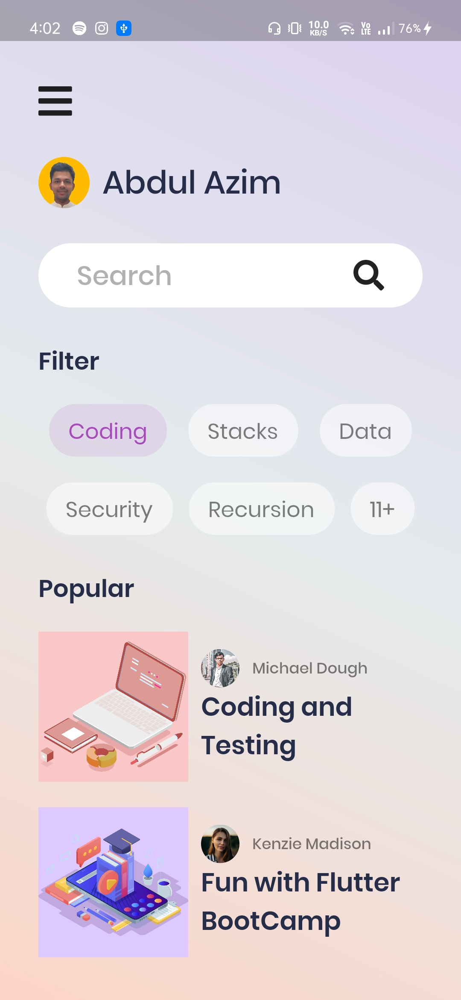
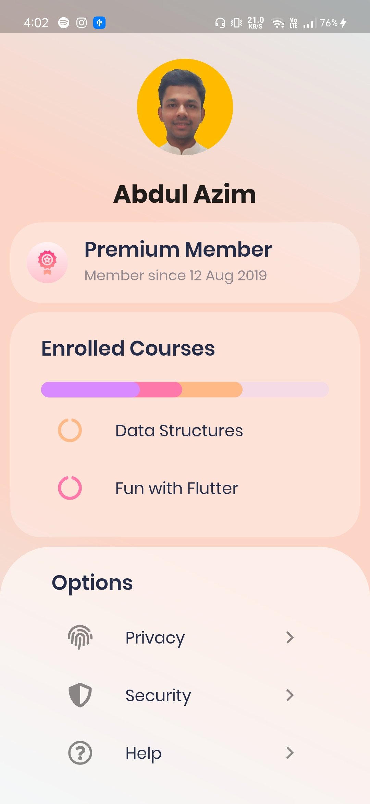
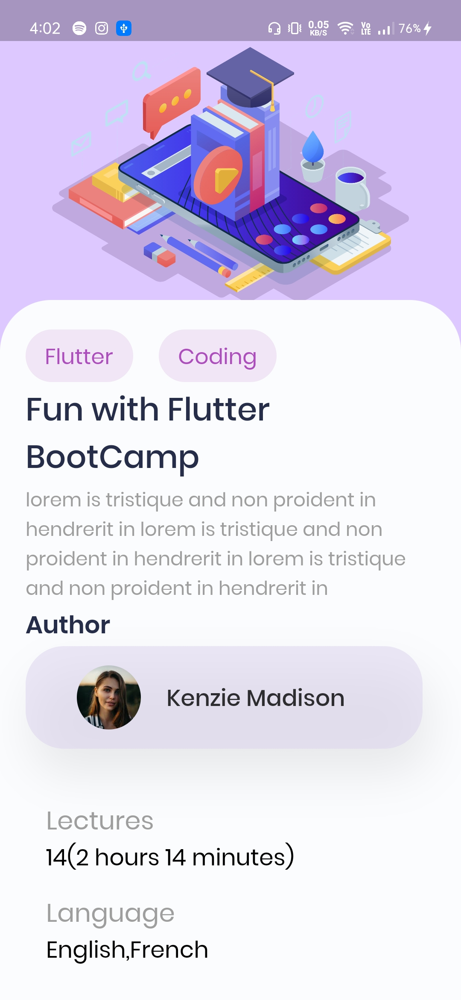

# Online Course UI 🎓

<!--  -->

A clean and simple UI for Online Course App made with Flutter.

## Screenshots

<p float="left">




</p>

# Command To Install

### Install dependencies

```sh
flutter pub get
```

### Run application

```sh
flutter emulators --launch <emulator_name>
flutter run
```

# Plugins

- [google_fonts](https://pub.dev/packages/google_fonts)
- [font_awesome_flutter](https://pub.dev/packages/font_awesome_flutter)
- [flutter_svg](https://pub.dev/packages/flutter_svg)

## Author

👨‍💻 **Abdul Azim**

* Github: [@azim2429](https://github.com/azim2429)

## Show your support

Give a ⭐️ if this project helped you!

## Credits

* Github: [KumarArab](https://github.com/KumarArab)
